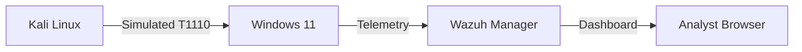

## Design Decisions: The "Why"

* **Wazuh (XDR/SIEM):** Selected for its dual capability to handle centralized log ingestion and agent-level File Integrity Monitoring (FIM). It serves as the single pane of glass for all endpoint security events.
* **Microsoft Sysmon:** Standard Windows Event Logs are historically blind to process lineage. Sysmon was deployed specifically to capture parent-child process relationships (e.g., `cmd.exe` executing `net.exe`), which is a critical requirement for detecting "Living off the Land" (LotL) techniques.
* **Network Isolation:** The environment is strictly contained within a virtualized network to ensure that threat simulations (such as automated brute-force attacks) are sandboxed and do not leak onto the physical production network.
* **Targeting Windows 11:** Chosen to represent a modern corporate endpoint. Engineering detections on a current operating system ensures the telemetry and alert rules are directly applicable to real-world enterprise environments.
