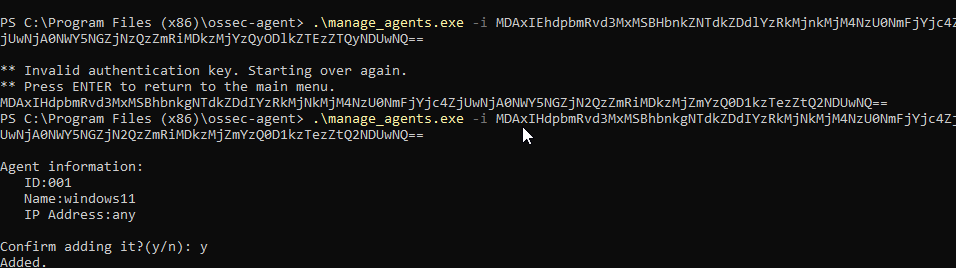
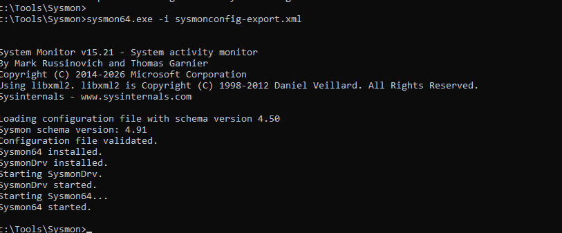
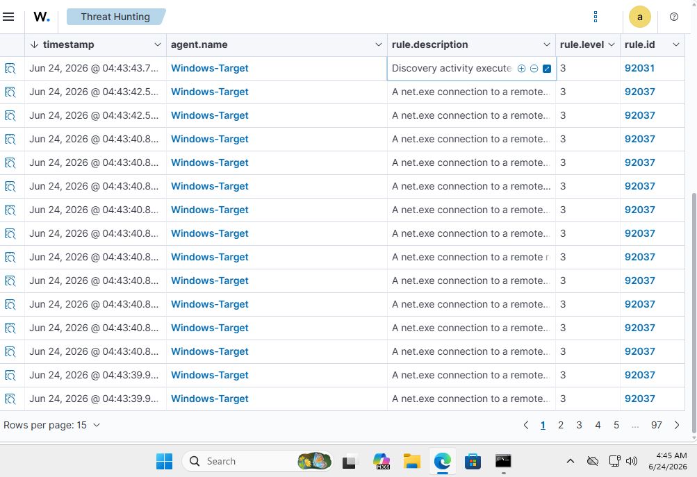
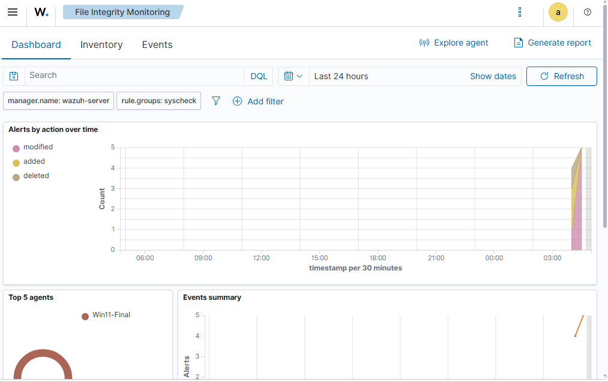
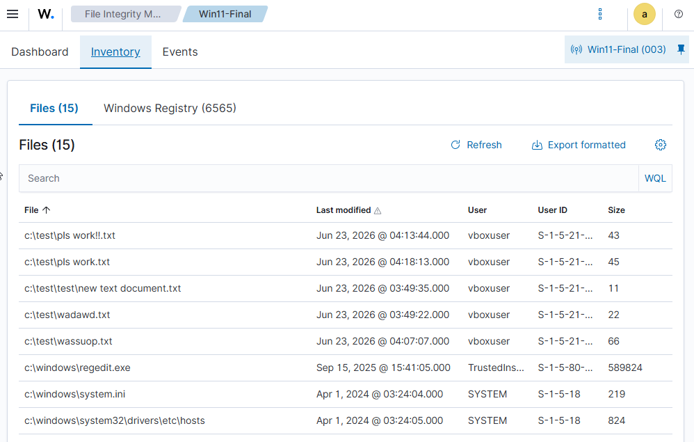
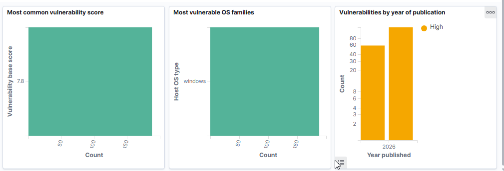

# Enterprise Security Operations Center (SOC) & Threat Simulation Homelab

## Project Overview
This project involved architecting and deploying a distributed, multi-node virtualized Security Information and Event Management (SIEM) environment using [Wazuh (XDR/SIEM)](https://wazuh.com/). The primary objective was to establish deep endpoint visibility on a Windows workstation, engineer defensive detection controls, and validate those controls by simulating real-world adversary behavior.

## Key Defensive Outcomes
* **Telemetry Engineering:** Deployed and tuned Microsoft Sysmon for granular process-level visibility.
* **Incident Detection:** Successfully correlated "Living off the Land" (LotL) attacks with high-fidelity SIEM alerts.
* **Infrastructure Resilience:** Practiced systematic troubleshooting of hypervisor resource constraints and configuration schema failures.

## Network Architecture
| Machine | OS | Role | Telemetry/Tools |
| :--- | :--- | :--- | :--- |
| **Wazuh Manager** | Ubuntu Linux | SIEM Brain | Indexer, Dashboard, Server |
| **Windows Target** | Windows 11 Ent. | Workstation | Wazuh Agent, Microsoft Sysmon |
| **Kali Linux** | Kali Linux | Red Team | Nmap, Atomic Simulation |

---

## Evidence Gallery

### 1. Installation & Infrastructure
* **Agent Deployment:** Initial registration and resolution of identity conflicts.

* **System Hardening:** Verification of custom Sysmon configuration baselines.

### 2. Detection & Threat Hunting
* **Adversary Simulation:** Capturing brute-force activity via `net.exe` and DLL hijacking.

* **File Integrity Monitoring:** Tracking unauthorized system file modifications in real-time.

### 3. Inventory & Vulnerability Management
* **Asset Visibility:** Registry and system package inventory scanning.

* **Vulnerability Detection:** Identifying and scoring CVEs within the host environment.

---

## Engineering Log (Selected Highlights)
* **UUID Conflict:** Resolved hypervisor-level duplicate identity panics by clearing the VirtualBox VDI cache.
* **XML Schema Tuning:** Corrected malformed `ossec.conf` syntax by performing log-based debugging of the Wazuh service output.
* **Resource Optimization:** Managed host-side RAM contention by tuning JVM heap allocations for the Wazuh Indexer.

## Future Roadmap
- [ ] **Automation:** Implement *Atomic Red Team* for automated framework-aligned testing.
- [ ] **Integration:** Configure Discord webhooks for real-time alert triage.
- [ ] **Scaling:** Expand lab to include an Active Directory Domain Controller for lateral movement analysis.
